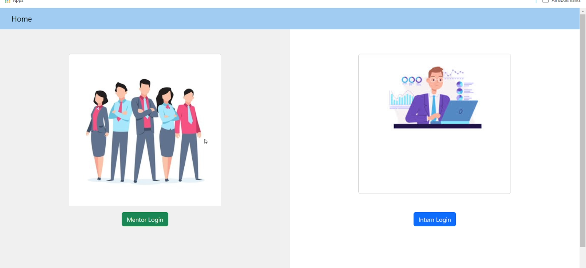
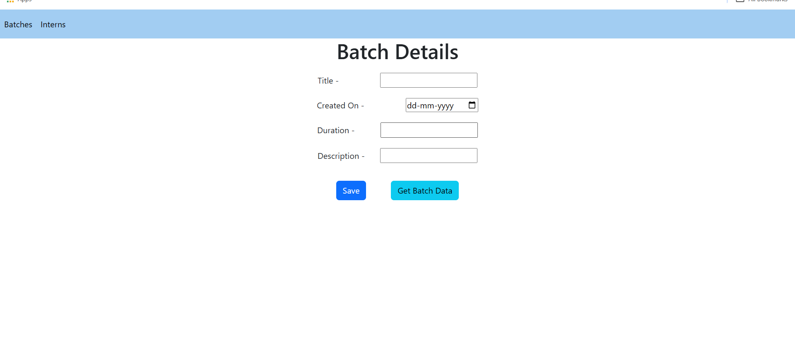
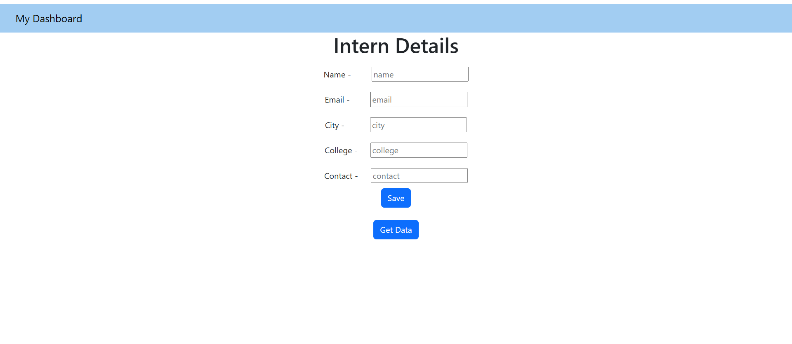
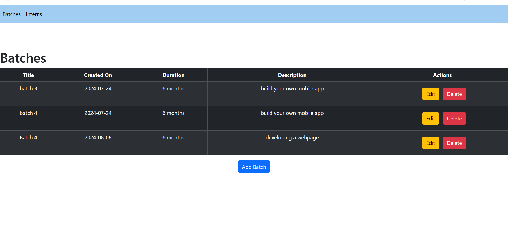

# 🎓 Internship Management System

A full-stack web application built with **React.js** and **JSON Server** for managing interns and internship batches. The system provides separate portals for Interns and Mentors with role-based access and CRUD capabilities.

---
## 🖼️ Preview

<p align="center">
  
</p>

## 🚀 Features

### 👤 Intern Portal
- Secure login with username & password authentication
- Register and submit personal details (name, email, city, college, contact)
- View all registered intern records in a tabular format
- Edit and delete intern entries

### 🧑‍🏫 Mentor Portal
- Separate mentor login with credential verification
- Create and manage internship batches (title, start date, duration, description)
- View all existing batches in a table
- Edit and delete batch records
- Quick navigation between Batches and Interns views

---

## 🛠️ Tech Stack

| Layer      | Technology                          |
|------------|--------------------------------------|
| Frontend   | React.js 18, React Bootstrap 5       |
| Routing    | React Router DOM v6                  |
| HTTP Client| Axios                                |
| Backend    | JSON Server (REST API mock)          |
| Styling    | Bootstrap 5, Custom CSS              |

---

## 📁 Project Structure

```
Internship-Management-System/
├── public/
│   └── index.html
├── src/
│   ├── Components/
│   │   ├── Home.js            # Landing page with role selection
│   │   ├── Home.css
│   │   ├── Internlogin.js     # Intern authentication
│   │   ├── Interlogin.css
│   │   ├── Internview.js      # Add intern details form
│   │   ├── Interntable.js     # View/Edit/Delete interns table
│   │   ├── Updatedata.js      # Edit intern record
│   │   ├── Mentorlogin.js     # Mentor authentication
│   │   ├── Mentorview.js      # Add batch details form
│   │   ├── Batchtable.js      # View/Edit/Delete batches table
│   │   ├── Updatebatchdata.js # Edit batch record
│   │   └── Navbar.js
│   ├── App.js                 # Route definitions
│   ├── App.css
│   └── index.js
├── interndb.json              # JSON Server database
├── package.json
└── README.md
```

---

## ⚙️ Getting Started

### Prerequisites

- [Node.js](https://nodejs.org/) (v14 or higher)
- npm

### Installation

1. **Clone the repository**
   ```bash
   git clone https://github.com/thevaibhavsengar/Internship-Management-System-.git
   cd Internship-Management-System-
   ```

2. **Install dependencies**
   ```bash
   npm install
   ```

3. **Start the JSON Server (backend)**
   ```bash
   npx json-server --watch interndb.json --port 4000
   ```

4. **Start the React app (in a new terminal)**
   ```bash
   npm start
   ```

5. **Open in browser**
   ```
   http://localhost:3000
   ```

---

## 🔐 Default Credentials

| Role   | Username | Password    |
|--------|----------|-------------|
| Intern | Vaibhav  | Vaibhav123  |
| Mentor | rachit1  | rachit123   |

> ⚠️ These credentials are stored in `interndb.json`. This is a mock backend for development purposes only — do not use in production.

---

## 📌 Application Routes

| Route               | Component       | Description                  |
|---------------------|-----------------|------------------------------|
| `/`                 | Home            | Landing page                 |
| `/interLogin`       | Internlogin     | Intern login                 |
| `/mentorlogin`      | Mentorlogin     | Mentor login                 |
| `/signup`           | Internview      | Add intern details           |
| `/get`              | Interntable     | View all interns             |
| `/update/:id`       | Updatedata      | Edit an intern record        |
| `/mentorview`       | Mentorview      | Add batch details            |
| `/getBatchData`     | Batchtable      | View all batches             |
| `/batchUpdate/:id`  | Updatebatchdata | Edit a batch record          |

---

## 📷 Screenshots

<p align="center">
  
</p>
<p align="center">
  
</p>
<p align="center">
  
</p>
---

## 🤝 Contributing

Contributions are welcome! Feel free to open an issue or submit a pull request.

1. Fork the project
2. Create your feature branch (`git checkout -b feature/YourFeature`)
3. Commit your changes (`git commit -m 'Add YourFeature'`)
4. Push to the branch (`git push origin feature/YourFeature`)
5. Open a Pull Request

---

## 👨‍💻 Author

**Vaibhav Sengar**
- GitHub: [@thevaibhavsengar](https://github.com/thevaibhavsengar)

---

## 📄 License

This project is licensed under the [ISC License](https://opensource.org/licenses/ISC).
